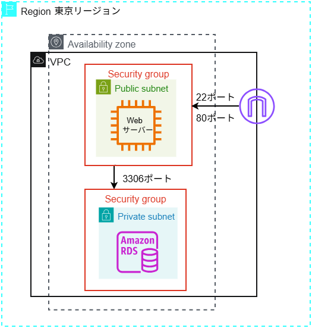

# 🚀 AWS Webアプリケーション基盤構築プロジェクト (Terraform/IaC)

## 💡 プロジェクト概要と目標

概要：私は9月末にAWS認定クラウドプラクティショナーを取得し、AWSの基礎概念を理解しました。また、AIからの助言も踏まえ、実践的なネットワーク構築経験が最も有効なアピールになると判断しました。この背景に基づき、座学の知識から一歩進み、自身の力でAWS上に管理可能なネットワーク環境を構築しようと思いました。
   　　
* **目標**: クラウド上のネットワーク設計、セキュリティ設計、リソースのデプロイ、および構成管理の習熟。
* **環境**: AWS (ap-northeast-1 / 東京リージョン)

---

## ⚙️ 技術スタックと構成図

### 技術スタック
| カテゴリ | 採用技術 |
| :--- | :--- |
| **クラウド** | AWS (VPC, EC2, RDS, Security Group, IGW) |
| **IaC** | Terraform (HCL) |
| **Web/DB** | Apache HTTP Server, PHP, MySQL (RDS) |
| **AI** | Gemini,chatGPT |

### インフラ構成図

* **VPC設計**: セキュリティレベルに応じて **パブリックサブネット** と **プライベートサブネット** に分割。
* **Web/DB配置**: EC2 Webサーバーをパブリックに、機密情報を含む RDS データベースをプライベートに配置し、データ層をインターネットから隔離。
* **セキュリティ**: セキュリティグループ（SG）で通信を厳密に制御。EC2は**ssh**（ポート 22）と**HTTP**（ポート 80）のみ許可。RDSは**EC2からのアクセス**（ポート 3306）のみ許可。

---

## 🌟 工夫点と課題解決 

### 1. IaCにおけるインフラの安定性確保

Terraformでコードの変数定義を変更した際、Webサーバー (EC2) が**「再作成（破壊的変更）」**されるリスクが発生しました。

* **対応**: `aws_instance` リソースに対し、**`lifecycle` ブロック**の **`ignore_changes`** を設定し、EC2の再作成を回避。デプロイの安定性とインフラの継続性を担保しました。

### 2. コードの保守性とセキュリティ向上

* **コード整理**: 変更可能性がある値(regionなど)と機密情報(RDSのパスワードなど)を変数定義し、それを **`variables.tf`** ファイルにまとめた。それによって、main.tf(リソース定義)の可読性と機密性の向上。
* **機密情報の管理**: **`.gitignore`** を用いて機密情報ファイルがGitHubにアップロードされない仕組みを徹底した。

### 3.　疎通確認と動作検証の実施
Web層の疎通確認: EC2インスタンスのパブリックIPアドレスを取得し、HTTP通信によりWebサーバーがインターネットから正常にアクセスできることを確認した。
DB接続の動作検証: PHPファイル内にRDSの接続情報と**トライキャッチ構文（エラーハンドリング）**を記述し、WebサーバーからRDSサーバーへのデータベース接続が正常に行えることを検証した。

### 4. RDSインスタンスのデプロイ中にエラー
**エラー**DB サブネットグループがアベイラビリティーゾーン (AZ) のカバレッジ要件を満たしていません。という旨のエラーが発生。
* **原因**：AWS RDS（リレーショナルデータベースサービス）は、高い可用性（サービスが停止しないこと）を確保するため、データベースインスタンスを配置するDBサブネットグループに対して、最低 2 つのアベイラビリティゾーン（AZ）をカバーするプライベートサブネットが必要。
しかし、 Terraform (HCL)で定義しているプライベートサブネットは、単一のAZ（ap-northeast-1a）にしか定義していなかった。
* **解決策**：main.tfファイルに2つ目のプライベートサブネットを異なるAZに作成した。この時、既存のプライベートサブネットとCIDRが重ならないように気を付けた。
この問題を通して可用性と耐久性を上げるMulti-AZ構成の理解を深めた。
* **備考**：Terraform (HCL)で２つのAZとプライベートサブネットを定義したが、インフラ構成図にはそれぞれ一つずつだけしか載せてない。理由は、コストを抑える目的でRDSインスタンスのMulti-AZ設定 (multi_az = true) を意図的に省略し、シングルAZで構築したから。

